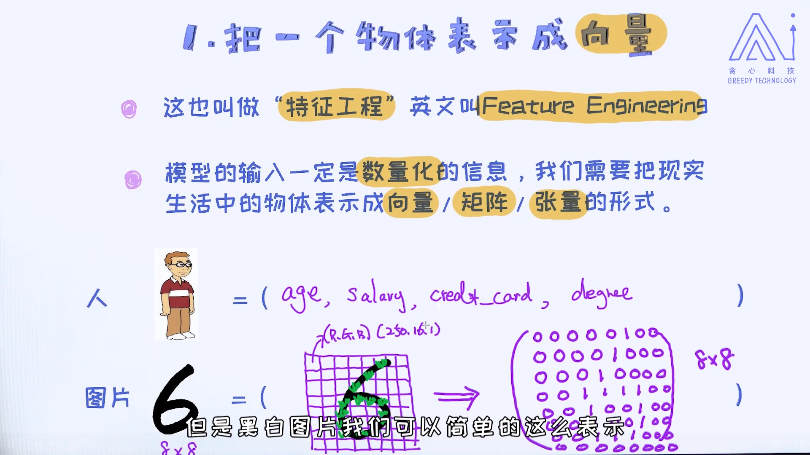

# 1. 第一个监督学习算法KNN（K近邻算法）
**文字总结：** 给定一个预测目标，接下来计算预测“预测目标”和“所有样本”之间的距离或者相似度，然后选择距离最近的前K个样本，然后通过这些样本来投票决策。 

如图示：


一般对于二分类问题来说，把K设置为奇数是容易防止平局的现象。但对于多分类来说，设置为奇数未必一定能够防平局。

## 1.1. 代码实例

```python
'''
# 1) 导入模块
第一个import是用来导入一个样本数据。sklearn库本身已经提供了不少可以用来测试模型的样本数据，所以通过这个模块的导入就可以直接使用这些数据了。
第二个import是用来做数据集的分割，把数据分成训练集和测试集，这样做的目的是为了评估模型。
第三个是导入了KNN的模块，是sklearn提供的现成的算法。

# 2) 导入数据集
这几行代码是用来导入数据集的。在这里我们导入的数据集叫做iris数据集，也是开源数据中最为重要的数据集之一。
这个数据包含了3个类别，所以适合的问题是分类问题。另外，具体数据集的描述可以参考：https://archive.ics.uci.edu/ml/datasets/Iris/
从print(x,y)结果可以看到X拥有四个特征，并且标签y拥有0，1，2三种不同的值。

# 3) 数据集分割
在这里X存储的是数据的特征，y存储的每一个样本的标签或者分类。我们使用 train_test_split来把数据分成了训练集和测试集。主要的目的是为了在训练过程中也可以验证模型的效果。如果没有办法验证，则无法知道模型训练的好坏。 

# 4) 使用KNN算法
这部分是KNN算法的主要模块。首先在这里我们定义了一个KNN object，它带有一个参数叫做n_neighbors=3， 意思就是说我们选择的K值是3. 

# 5) 模型评估
这部分的代码主要用来做预测以及计算准确率。计算准确率的逻辑也很简单，就是判断预测和实际值有多少是相等的。如果相等则算预测正确，否则预测失败。
'''
# 1) 导入模块
from sklearn import datasets    
from sklearn.model_selection import train_test_split    
from sklearn.neighbors import KNeighborsClassifier    
import numpy as np    

# 2) 导入数据集
iris = datasets.load_iris()    
X = iris.data    
y = iris.target    
print (X, y)    

# 3) 数据集分割
X_train, X_test, y_train, y_test = train_test_split(X, y, random_state=2003)    

# 4) 使用KNN算法
clf = KNeighborsClassifier(n_neighbors=3)    
clf.fit(X_train, y_train)    

# 5) 模型评估
correct = np.count_nonzero((clf.predict(X_test)==y_test)==True)    
print ("Accuracy is: %.3f" %(correct/len(X_test)))
```
# 2. KNN算法的具体实现细节
为了实现一个KNN算法，我们需要具备四个方面的信息。

`向量化-->标注-->距离计算-->k的选择`

1. 把一个物体表示成向量
2. 标记好每个物体的标签（i.e.，offer / no offer）
3. 计算两个物体之间的距离/相似度
4. 选择合适的k

第一、任何的算法的输入一定是数量化的信息，我们把它叫做特征，需要把现实生活中的物体通过数字化的特征来进行描述。



第二、由于KNN是监督学习算法，所以需要提前标注好的样本。


第三、我们需要想办法来计算两个样本之间的距离或者相似度，之后才能选出最相近的样本。


第四、需要知道如何选择最合适的K值，那为了理解这一点首先要理解K对模型本身的影响。这部分在第二节里我会做重点解释。

## 自定义代码实现
```python
from sklearn import datasets
from collections import Counter  # 为了做投票
from sklearn.model_selection import train_test_split
import numpy as np

# 导入iris数据
iris = datasets.load_iris()
X = iris.data
y = iris.target
X_train, X_test, y_train, y_test = train_test_split(X, y, random_state=2003)

def euc_dis(instance1, instance2):
    """
    计算两个样本instance1和instance2之间的欧式距离
    instance1: 第一个样本， array型
    instance2: 第二个样本， array型
    """
    # TODO
    dist = np.sqrt(sum((instance1 - instance2)**2))
    return dist
    
    
def knn_classify(X, y, testInstance, k):
    """
    给定一个测试数据testInstance, 通过KNN算法来预测它的标签。 
    X: 训练数据的特征
    y: 训练数据的标签
    testInstance: 测试数据，这里假定一个测试数据 array型
    k: 选择多少个neighbors? 
    """
    # TODO  返回testInstance的预测标签 = {0,1,2}
    distances = [euc_dis(x, testInstance) for x in X]
    kneighbors = np.argsort(distances)[:k]
    count = Counter(y[kneighbors])
    return count.most_common()[0][0]

# 预测结果。    
predictions = [knn_classify(X_train, y_train, data, 3) for data in X_test]
correct = np.count_nonzero((predictions==y_test)==True)
print ("Accuracy is: %.3f" %(correct/len(X_test)))
```